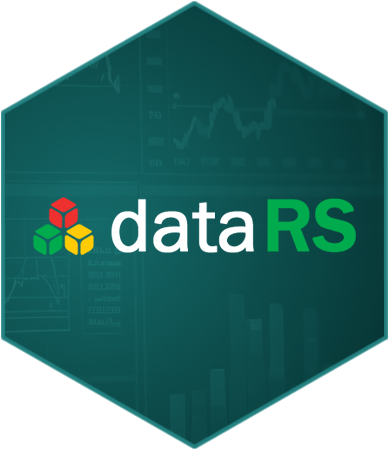

# dataRS: an R package for DataRS API database

## Introduction 

dataRS is an R package for downloading socioeconomic data for the state of Rio Grande do Sul using DataRS API.
The API documentation can be accessed [here](https://datars.dee.rs.gov.br/api/).

 
## Installation via GitHub

```r
library(devtools)

devtools::install_github("fernandoilcruz/dataRS", build_vignettes = TRUE)
